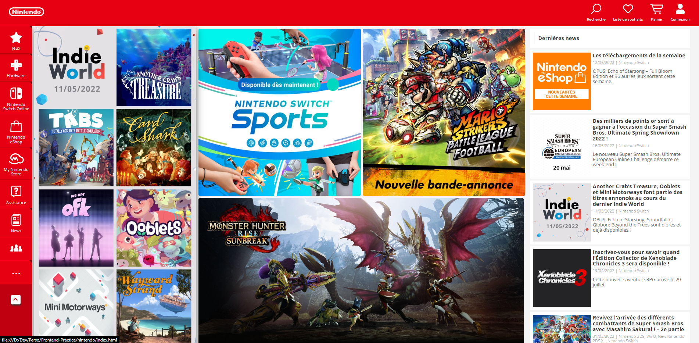

# Projet Nintendo
Ce projet a pour but de mettre en pratique mes compétences en développement front-end (HTML et CSS) en réalisant une réplique de la page d'accueil du site officiel de Nintendo.

## Prérequis
Pour pouvoir utiliser ce projet, vous aurez besoin de :

- Un navigateur web (Google Chrome, Mozilla Firefox, Safari, etc.)
- Un éditeur de code (Visual Studio Code, Sublime Text, etc.)

## Installation
Pour utiliser ce projet, vous pouvez télécharger le code source en cliquant sur le bouton "Clone or download" puis sur "Download ZIP". Vous pouvez également cloner le dépôt en utilisant Git en tapant la commande suivante dans votre terminal :

```
git clone https://github.com/Remi-Debu/Nintendo.git
```

## Utilisation
Pour ouvrir le projet, ouvrez le fichier index.html avec votre navigateur web. Vous devriez voir s'afficher la page d'accueil de Nintendo. Si vous souhaitez modifier le code, ouvrez le fichier avec votre éditeur de code.

## Crédits
Le design de la page a été inspiré par le site officiel de Nintendo disponible à l'adresse https://www.nintendo.com/.
 
## Aperçu de la reproduction
